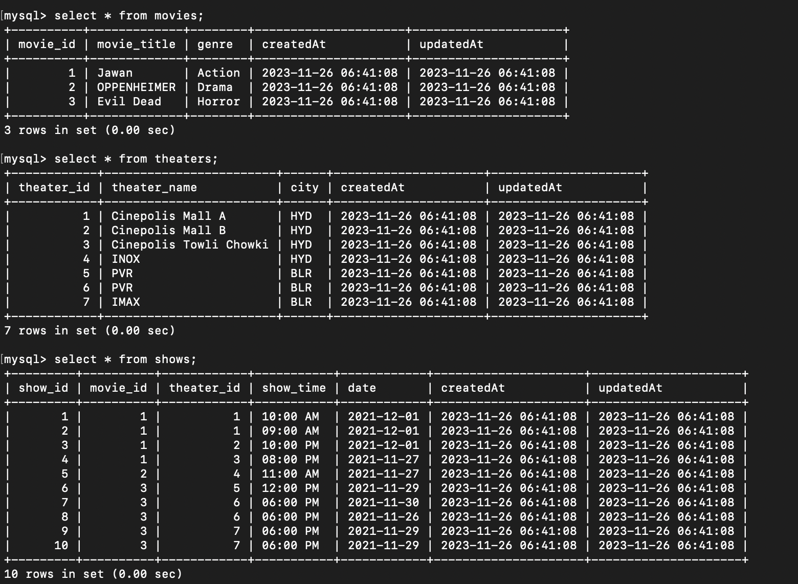

# airtribe_Bookmyshow

Movie Ticket booking app, to check the movie and show timing

Installation

- Clone the repository: git clone https://github.com/mushtaque87/airtribe_Bookmyshow
- Install MySQL from (https://www.mysql.com/downloads/)
- Install the dependencies: npm install or yarn install
- Start the server: npm server or yarn server

The server will start and connect to MySQL database hosted locally and creates all the tables.

## API Endpoints

### POST /seedAllData

_Fill data in the db. Make a post request and the endpoint will first fill all the movie and show releated datas in the db_



### GET /show

_Get all the show timing for a particular city and theater and date_

http://localhost:4000/show?city=HYD&theater_id=2&date=2021-12-01

````{
    "city": "HYD",
    "date": "2021-12-01",
    "theater_id": 2
}```
````
