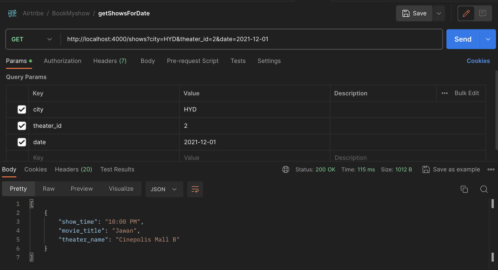

# airtribe_Bookmyshow

Movie Ticket booking app, to check the movie and show timing

Installation

- Clone the repository: git clone https://github.com/mushtaque87/airtribe_Bookmyshow
- Install MySQL from (https://www.mysql.com/downloads/)
- Install the dependencies: npm install or yarn install
- Start the server: npm server or yarn server

The server will start and connect to MySQL database hosted locally and creates all the tables.

## API Endpoints

### POST /seedAllData

_Fill data in the db. Make a post request and the endpoint will first fill all the movie and show releated datas in the db_


### GET /show

_Get all the show timing for a particular city and theater and date_

http://localhost:4000/show?city=HYD&theater_id=2&date=2021-12-01

```
[
    {
        "show_time": "10:00 PM",
        "movie_title": "Jawan",
        "theater_name": "Cinepolis Mall B"
    },
     {
        "show_time": "8:00 PM",
        "movie_title": "Jawan",
        "theater_name": "Cinepolis Mall B"
    }
]
```

### Redis Integration

The app has redis integrated to maintain a local cache to serve the response faster.

Created a middleware

_readCache_ and _saveCache_

`showRouter.get('/shows', readCache, getShow, saveCache);`

The server checks for the given query in the redis cache before reading from database. If the shows are available then it serves it from cache or else fetch from DB and store in cache for next query.

Here is the difference in the time taken to response.



_It takes 115 ms to fetch from DB and server the data_


_It takes 15 ms to fetch from Cache and server the data_
